# Integration and API Test Report

Date: 23/05/2022

Version: 1.0

# Contents

- [Dependency graph](#dependency&nbspgraph)

- [Integration approach](#integration-approach)

- [Tests](#integration-tests)

- [Scenarios](#scenarios)

- [Coverage of scenarios and FR](#scenario-coverage)
- [Coverage of non-functional requirements](#nfr-coverage)

# Dependency graph 

```plantuml
@startuml
entity internalOrder
entity item
entity position
entity restockOrder
entity returnOrder
entity sku
entity skuItem
entity TestDescriptor
entity TestResult
entity User

class internalOrderController
class itemController
class positionController
class restockOrderController
class returnOrderController
class skuController
class skuItemController
class testDescriptorController
class testResultController
class userController

class internalOrderRepository
class itemRepository
class positionRepository
class restockOrderRepository
class returnOrderRepository
class skuRepository
class skuItemRepository
class testDescriptorRepository
class testResultRepository
class userRepository

class internalOrderRouter
class itemRouter
class positionRouter
class restockOrderRouter
class returnOrderRouter
class skuRouter
class skuItemRouter
class testDescriptorRouter
class testResultRouter
class userRouter

class dateHandler
class DBHandler

internalOrderRepository -- internalOrder
internalOrderRepository -- dateHandler
itemRepository -- item
positionRepository -- position
restockOrderRepository -- restockOrder
restockOrderRepository -- dateHandler
restockOrderRepository -- itemRepository
restockOrderRepository -- skuItemRepository
returnOrderRepository -- returnOrder
skuItemRepository -- skuItem
skuRepository -- sku
userRepository -- User
DBHandler -- internalOrderRepository
DBHandler -- itemRepository
DBHandler -- positionRepository
DBHandler -- restockOrderRepository
DBHandler -- returnOrderRepository
DBHandler -- skuItemRepository
DBHandler -- skuRepository
DBHandler -- userRepository
DBHandler -- testDescriptorRepository
DBHandler -- testResultRepository

internalOrderController -- internalOrder
internalOrderController -- dateHandler
internalOrderController -- internalOrderRepository
itemController -- item
itemController -- itemRepository
positionController -- position
positionController -- positionRepository
restockOrderController -- dateHandler
restockOrderController -- restockOrderRepository
returnOrderController -- returnOrder
returnOrderController -- returnOrderRepository
skuController -- SKU
skuController -- SKURepository
skuController -- testDescriptorRepository
skuController -- positionRepository
skuItemController -- skuItemRepository
skuItemController -- skuRepository
testDescriptorController -- testDescriptorRepository
testResultController -- testResultRepository
testResultController -- testDescriptorRepository
userController -- user
userController -- userRepository

internalOrderRouter -- internalOrderController
itemRouter -- itemController
positionRouter -- positionController
restockOrderRouter -- restockOrderController
returnOrderRouter -- returnOrderController
skuRouter -- skuController
skuItemRouter -- skuItemController
testDescriptorRouter -- testDescriptorController
testResultRouter -- testResultController
userRouter -- userController

@enduml 
```

# Integration approach

    The integration sequence adopted is Bottom Up.

#  Integration Tests

   <define below a table for each integration step. For each integration step report the group of classes under test, and the names of
     Jest test cases applied to them, and the mock ups used, if any> Jest test cases should be here code/server/unit_test

## Step 1
| Classes                  | mock up used | Jest test cases                                                                                                         |
|--------------------------|--------------|-------------------------------------------------------------------------------------------------------------------------|
| SKURepository            |              | testEditSKU(newSKU, id, expected), testEditSKUPosition(position, id, expected)                                          |
| SKUItemRepository        |              | testAddSKUItem(newSKUItem,expected),testDeleteSKUItem(rfid,expected)                                                    |
| ItemRepository           |              | testAddItem(newitem,expected), testDeleteitem(id,expected)                                                              |
| PositionRepository       |              | testGetPosition(id, expected), testEditPositionID(pos, id, newid, expected), testEditPositionByID(pos, id, newid, expected) |
| testDescriptorRepository |              | Test Descriptor Unit Test                                                                                               |
| testDescriptorRepository |              | Test Descriptor Unit Test                                                                                               |
| testResultRepository     |              | Test Result Unit Test                                                                                                   |
| testResultRepository     |              | Test Result Unit Test                                                                                                   |

## Step 2
| Classes  | mock up used |Jest test cases |
|--|--|--|
|SKUController|-|testEditSKUController(newSKU, id, expected), testEditSKUPositionController(position, id, expected)|
|SKUItemController|-|testEditSKUItem(newSKUItem,rfid,expected)|
|ItemController|-|testEditItem(newItem,id,expected)|
| testDescriptorController      |              | Test Descriptor Unit Test |
| testDescriptorController      |              | Test Descriptor Unit Test |
| testResultController          |              | Test Result Unit Test |
| testResultController          |              | Test Result Unit Test |

## Step 3 

| Classes  | mock up used |Mocha test cases |
|--|--|--|
|router/SKU|-|addSKU(expectedHTTPStatus, newSKU) getSingleSKU(expectedHTTPStatus, expectedBody, id) getSKUs(expectedHTTPStatus, expectedBody) editSKU(expectedHTTPStatus, id, newSKU) editSKUPosition(expectedHTTPStatus, id, position) deleteSKU(expectedHTTPStatus, id)|
|router/SKUItem|-|addSKUItem(expectedHTTPStatus, newSKUItem)  getSKUItemByRFID(expectedHTTPStatus, expectedBody, rfid) getSKUItemBySKUId(expectedHTTPStatus, expectedBody, id) getSKUItems(expectedHTTPStatus, expectedBody) editSKUItem(expectedHTTPStatus, rfid, newSKUItem) deleteSKUItem(expectedHTTPStatus, rfid)|
|router/Item|-|addItem(expectedHTTPStatus, newItem) getItemById(expectedHTTPStatus, expectedBody, id) getItems(expectedHTTPStatus, expectedBody) editItem(expectedHTTPStatus, id, newItem) deleteSKU(expectedHTTPStatus, id)|
|router/Position|-|addPosition(expectedHTTPStatus, newPosition) getPositions(expectedHTTPStatus, expectedBody) editPosition(expectedHTTPStatus, id, newPosition) editPositionByID(xpectedHTTPStatus, id, newPosition) deletePosition(expectedHTTPStatus, id)|
| router/testDescriptor      |              | Test Descriptor API Test |
| router/testDescriptor      |              | Test Descriptor API Test |
| router/testResult          |              | Test Result API Test |
| router/testResult          |              | Test Result API Test |

# API testing - Scenarios

<If needed, define here additional scenarios for the application. Scenarios should be named
 referring the UC in the OfficialRequirements that they detail>

## Scenario UC1.4

| Scenario |  name |
| ------------- |:-------------:|
|  Precondition     | Manager M exists and is logged in |
|  Post condition     | S  out the system |
| Step#        | Description  |
|  1     | M selects SKU to delete |
|  2     | M confirms the SKU selected |

## Scenario UC1.5

| Scenario       |               name                |
| -------------- | :-------------------------------: |
| Precondition   | Manager M exists and is logged in |
| Post condition |      List of S are displayed      |
| Step#          |            Description            |
| 1              |      M selects list of SKUs       |
| 2              |     System show list of SKUs      |

## Scenario UC1.6

| Scenario       |               name                |
| -------------- | :-------------------------------: |
| Precondition   | Manager M exists and is logged in |
| Post condition |      S selected is displayed      |
| Step#          |            Description            |
| 1              |       M send Id of the SKU        |
| 2              |    System display SKU selected    |

## Scenario UC2.2

| Scenario       |               name                |
| -------------- | :-------------------------------: |
| Precondition   | Manager M exists and is logged in |
| Post condition |      P's positionID is updated    |
| Step#          |            Description            |
| 1              |       M selects position P         |
| 2              |   M defines new positionID for P   |
| 3              |   System updates aisleID, row and col   |

## Scenario UC2.4

| Scenario       |               name                |
| -------------- | :-------------------------------: |
| Precondition   | Manager M exists and is logged in |
| Post condition |      P's aisle ID, row and column updated    |
| Step#          |            Description            |
| 1              |       M selects position P         |
| 2              |   M defines new aisle ID for P   |
| 3              |   M defines new row ID for P   |
| 4              |   M defines new col ID for P   |
| 5              |   System updates PositionID   |

## Scenario UC 5-2-4

| Scenario            |              Get all test results for a SKU Item              |
|---------------------|:-------------------------------------------------------------:|
| Precondition        |          Quality Employee Q exists and is logged in           |
|                     |                         SKU S exists                          |
|                     |                     SKU position is valid                     |
|                     |               The SKU Item has an RFID attached               |
| Post condition      |            The associated test results are fetched            |
| Step#               |                          Description                          |
| 1                   | Q requests to fetch all test results associated to a SKU Item |
| 2                   |                      Q confirms the data                      |

## Scenario UC 5-2-5

| Scenario            |                Get a test result for a SKU                 |
|---------------------|:----------------------------------------------------------:|
| Precondition        |         Quality Employee Q exists and is logged in         |
|                     |                        SKU S exists                        |
|                     |                   SKU position is valid                    |
|                     |             The SKU Item has an RFID attached              |
| Post condition      |           The associated test result is fetched            |
| Step#               |                        Description                         |
| 1                   | Q requests to fetch a test result associated to a SKU Item |
| 2                   |                    Q confirms the data                     |

## Scenario UC 5-2-6

| Scenario       |             Update a test result for a SKU Item             |
|----------------|:-----------------------------------------------------------:|
| Precondition   |         Quality Employee Q exists and is logged in          |
|                |                        SKU S exists                         |
|                |                    SKU position is valid                    |
|                |              The SKU Item has an RFID attached              |
| Post condition |            The associated test result is updated            |
| Step#          |                         Description                         |
| 1              | Q requests to update a test result associated to a SKU Item |
| 2              |                    Q sends the new data                     |
| 3              |                     Q confirms the data                     |

## Scenario UC 5-2-7

| Scenario       |             Delete a test result for a SKU Item             |
|----------------|:-----------------------------------------------------------:|
| Precondition   |         Quality Employee Q exists and is logged in          |
|                |                        SKU S exists                         |
|                |                    SKU position is valid                    |
|                |              The SKU Item has an RFID attached              |
| Post condition |            The associated test result is deleted            |
| Step#          |                         Description                         |
| 1              | Q requests to delete a test result associated to a SKU Item |
| 3              |                   Q confirms the deletion                   |

## Scenario UC 12-4

| Scenario       |      Update test description      |
|----------------|:---------------------------------:|
| Precondition   | Manager M exists and is logged in |
|                |     Test description T exists     |
| Post condition |   All test descriptions fetched   |
| Step#          |            Description            |
| 1              |        M requests the data        |
| 2              |    M confirms the fetched data    |

## Scenario UC 12-5

| Scenario       |                Update test description                 |
|----------------|:------------------------------------------------------:|
| Precondition   |           Manager M exists and is logged in            |
|                |               Test description T exists                |
| Post condition |           Selected test description fetched            |
| Step#          |                      Description                       |
| 1              |         M select the id of the test descriptor         |
| 2              | M requests the fetch for id associated test descriptor |
| 3              |              M confirms the fetched data               |

## Scenario UC12.6

| Scenario       |               name                |
| -------------- | :-------------------------------: |
| Precondition   | Manager M exists and is logged in |
| Post condition |        SI is out of system        |
| Step#          |            Description            |
| 1              |    M selects SI to be deleted     |
| 2              |    M confirms the SI selected     |

# Coverage of Scenarios and FR

<Report in the following table the coverage of  scenarios (from official requirements and from above) vs FR. 
Report also for each of the scenarios the (one or more) API Mocha tests that cover it. >  Mocha test cases should be here code/server/test

| Scenario ID                                            | Functional Requirements covered                      | Mocha  Test(s)                                                                                                                                                                                                                                                                  |
|--------------------------------------------------------|------------------------------------------------------|---------------------------------------------------------------------------------------------------------------------------------------------------------------------------------------------------------------------------------------------------------------------------------|
| Scenario 1-1 Scenario 1-2 Scenario 1-3       | FR2 Manage SKU                                       | addSKU(expectedHTTPStatus, newSKU) getSingleSKU(expectedHTTPStatus, expectedBody, id) getSKUs(expectedHTTPStatus, expectedBody) editSKU(expectedHTTPStatus, id, newSKU) editSKUPosition(expectedHTTPStatus, id, position) deleteSKU(expectedHTTPStatus, id) |
| Scenario 1-1 Scenario 1-2 Scenario 1-3       | FR2.1 Define a new SKU, or modify an existing SKU    | addSKU(expectedHTTPStatus, newSKU) editSKU(expectedHTTPStatus, id, newSKU) editSKUPosition(expectedHTTPStatus, id, position)                                                                                                                                            |
| Scenario 1-4                                           | FR2.2 Delete a SKU                                   | deleteSKU(expectedHTTPStatus, id)                                                                                                                                                                                                                                               |
| Scenario 1-5                                           | FR2.3 List all SKUs                                  | getSKUs(expectedHTTPStatus, expectedBody)                                                                                                                                                                                                                                       |
| Scenario 1-6                                           | FR2.4 Search a SKU (by ID)                           | getSingleSKU(expectedHTTPStatus, expectedBody, id)                                                                                                                                                                                                                              |
| Scenario 2-2                                           | FR3.1.1 Modify an existing position                  | editPosition(expectedHTTPStatus, id, newPosition)                                                                                                                                                                                                                               |
| Scenario 2-4                                           | FR3.1.4 Modify attributes of a position              | editPositionByID(expectedHTTPStatus, id, newPosition)                                                                                                                                                                                                                           |
| Scenario 5-2-1 Scenario 5-2-2 Scenario 5-2-3 | FR6.9 Select SKU Item with a FIFO criterion          | getSKUItemByRFID(expectedHTTPStatus, expectedBody, rfid) getSKUItemBySKUId(expectedHTTPStatus, expectedBody, id) getSKUItems(expectedHTTPStatus, expectedBody)                                                                                                      | 
| Scenario 5-2-1                                         | FR5.8.2 Store result of a quality test on a SKU Item | Test Result API Test >  TEST POST /api/skuitems/testResult                                                                                                                                                                                                                       |
| Scenario 5-2-2                                         | FR5.8.2 Store result of a quality test on a SKU Item | Test Result API Test >  TEST POST /api/skuitems/testResult                                                                                                                                                                                                                       |
| Scenario 5-2-3                                         | FR5.8.2 Store result of a quality test on a SKU Item | Test Result API Test >  TEST POST /api/skuitems/testResult                                                                                                                                                                                                                       |
| Scenario 5-2-4                                         | FR 3.2 Manage Quality Tests                          | Test Result API Test >  TEST GET /api/skuitems/:rfid/testResults                                                                                                                                                                                                                 |
| Scenario 5-2-5                                         | FR 3.2 Manage Quality Tests                          | Test Result API Test >  TEST GET /api/skuitems/:rfid/testResult/:id                                                                                                                                                                                                              |
| Scenario 5-2-6                                         | FR 3.2.2 Modify a quality test                       | Test Result API Test >  TEST PUT /api/skuitems/:rfid/testResult/:id                                                                                                                                                                                                              |
| Scenario 5-2-7                                         | FR 3.2.3 Delete a quality test                       | Test Result API Test >  TEST DELETE /api/skuitems/:rfid/testResult/:id                                                                                                                                                                                                           |
| Scenario 5-3-1 Scenario 5-3-3                     | FR5.8.3 Store a SKU Item                             | addSKUItem(expectedHTTPStatus, newSKUItem)                                                                                                                                                                                                                                  |            
| Scenario 11-1 Scenario 11-2                       | FR7 Manage Items                                     | addItem(expectedHTTPStatus, newItem) editItem(expectedHTTPStatus, id, newItem)                                                                                                                                                                                              |
| Scenario 12-1                                          | FR6.10 Remove SKU Item from warehouse                | deleteSKUItem(expectedHTTPStatus, rfid)                                                                                                                                                                                                                                         |
| Scenario 12-1                                          | FR3.2.1  Add a quality test                          | Test Descriptor API Test >  TEST POST /api/testDescriptor                                                                                                                                                                                                                        |
| Scenario 12-2                                          | FR3.2.2  Modify a quality test                       | Test Descriptor API Test >  TEST PUT /api/testDescriptor/:id                                                                                                                                                                                                                     |
| Scenario 12-3                                          | FR3.2.3  Delete a quality test                       | Test Descriptor API Test >  TEST DELETE /api/testDescriptor/:id                                                                                                                                                                                                                  |
| Scenario 12-4                                          | FR 3.2 Manage Quality Tests                                 | Test Descriptor API Test > TEST GET /api/testDescriptors       |
| Scenario 12-5                                          | FR 3.2 Manage Quality Tests                                 | Test Descriptor API Test > TEST GET /api/testDescriptor/:id    |

# Coverage of Non Functional Requirements

<Report in the following table the coverage of the Non Functional Requirements of the application - only those that can be tested with automated testing frameworks.>

### 

| Non Functional Requirement | Test name                                                                                                                                                                                                  |
| -------------------------- |------------------------------------------------------------------------------------------------------------------------------------------------------------------------------------------------------------|
| NFR9                       | addSKUItem(expectedHTTPStatus, newSKUItem)  editSKUItem(expectedHTTPStatus, rfid, newSKUItem)                                                                                                      |
|                            | Test Result API Test > TEST POST /api/skuitems/testResult TEST PUT /api/skuitems/:rfid/testResult/:id                                                                                                 |
| NFR6                       | addSKUItem(expectedHTTPStatus, newSKUItem)  getSKUItemByRFID(expectedHTTPStatus, expectedBody, rfid) editSKUItem(expectedHTTPStatus, rfid, newSKUItem) deleteSKUItem(expectedHTTPStatus, rfid) |
|                            | Test Result API Test > TEST POST /api/skuitems/testResult TEST GET /api/skuitems/:rfid/testResults TEST GET /api/skuitems/:rfid/testResult/:id TEST PUT /api/skuitems/:rfid/testResult/:id    |
| NFR4                       | editPosition(expectedHTTPStatus, id, newPosition) editPositionByID(expectedHTTPStatus, id, newPosition)                                                                                                |

