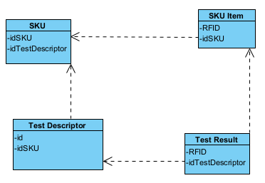

# Integration and API Test Report

Date:

Version:

# Contents

- [Dependency graph](#dependency graph)

- [Integration approach](#integration)

- [Tests](#tests)

- [Scenarios](#scenarios)

- [Coverage of scenarios and FR](#scenario-coverage)

- [Coverage of non-functional requirements](#nfr-coverage)

# Dependency graph

# Integration approach

> The approach we use here is ***Bottom-up***, in which we start from
> the lower-level DAO/repository modules up to Controllers.

#  Integration Tests

## Step 1
| Classes         | mock up used | Jest test cases                    |
|-----------------|--------------|------------------------------------|
| Test Descriptor |              | **updateTestDescriptor Black Box** |
| Test Descriptor |              | **deleteTestDescriptor Black Box** |

## Step 2
| Classes               | mock up used | Jest test cases                                                                     |
|-----------------------|--------------|-------------------------------------------------------------------------------------|
| Test Descriptor + SKU |              | updateTestDescriptor White Box: **updateTestDescriptor foreign key constraint** |
| Test Descriptor + SKU |              | General TestDescriptor White Box: **addTestDescriptor foreign key constraint**  |

# API testing - Scenarios

<If needed, define here additional scenarios for the application. Scenarios should be named
 referring the UC in the OfficialRequirements that they detail>

## Scenario 12-4

| Scenario       |      Update test description      |
|----------------|:---------------------------------:|
| Precondition   | Manager M exists and is logged in |
|                |     Test description T exists     |
| Post condition |   All test descriptions fetched   |
| Step#          |            Description            |
| 1              |        M requests the data        |
| 2              |    M confirms the fetched data    |

## Scenario 12-5

| Scenario       |                Update test description                 |
|----------------|:------------------------------------------------------:|
| Precondition   |           Manager M exists and is logged in            |
|                |               Test description T exists                |
| Post condition |           Selected test description fetched            |
| Step#          |                      Description                       |
| 1              |         M select the id of the test descriptor         |
| 2              | M requests the fetch for id associated test descriptor |
| 3              |              M confirms the fetched data               |

# Coverage of Scenarios and FR

<Report in the following table the coverage of  scenarios (from official requirements and from above) vs FR. 
Report also for each of the scenarios the (one or more) API Mocha tests that cover it. >  Mocha test cases should be here code/server/test

| Scenario ID | Functional Requirements covered | Mocha  Test(s)                      | 
|-------------|---------------------------------|-------------------------------------|
| 12-1        | FR3.2.1                         | TEST POST /api/testDescriptor       |
| 12-2        | FR3.2.2                         | TEST PUT /api/testDescriptor/:id    |
| 12-3        | FR3.2.3                         | TEST DELETE /api/testDescriptor/:id |
| 12-4        |                                 | TEST GET /api/testDescriptors       |
| 12-5        |                                 | TEST GET /api/testDescriptor/:id    |

# Coverage of Non Functional Requirements

| Non Functional Requirement | Test name |
|----------------------------|-----------|
| NFR2                       | All       |

