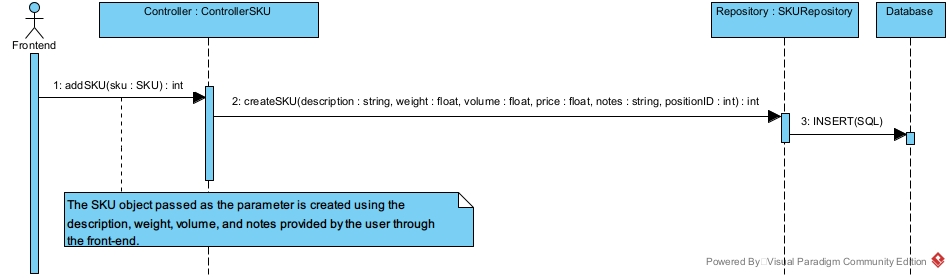

# Design Document

Authors: Edoardo Novara, Riccardo Salvatelli, Zhao Longsheng, Sebastian Gutierrez

Date: 25/04/2022

Version: 1.1

# Contents

- [High level design](#package-diagram)
- [Low level design](#class-diagram)
- [Verification traceability matrix](#verification-traceability-matrix)
- [Verification sequence diagrams](#verification-sequence-diagrams)

# Instructions

The design must satisfy the Official Requirements document, notably functional and non functional requirements, and be consistent with the APIs

# High level design

## **MVC - Client-Server Architecture**

We decided to use an MVC pattern with a Client-Server Architecture because the system design and the deployment diagram suggests that the application will be run in different devices simultaneously which makes easier to Employees from WH and different Suppliers interact together and manage restock items, by accessing a server where the EZWH application is deployed and is intractable with through the front-end . The MVC pattern is divided with the V on the front-end and the MC on the back-end.

### **Backend**

#### Controller

The controller package is in charge of the communication between the front-end and back-end and performs the functionalities of EZWH application.

#### Entity

The entity package contains all the entities from the EXWH model which all the data that must be handled. It is assumed that this package and the model contained in it is known also for the front-end.

#### Repository

This package is composed by repositories where each of which is related to a specific Entity. With this relation is possible to obtain the persistence for each Model class to the EZWH database.

# Low level design

### Controller

### Entity

### Repository

It is assumed that for the repository design the EZWH system works with only one Warehouse and one Inventory.

# Verification traceability matrix

# Verification sequence diagrams

\<select key scenarios from the requirement document. For each of them define a sequence diagram showing that the scenario can be implemented by the classes and methods in the design>
#### Use Case 1, UC1 - Manage SKUs - Scenario 1-1
|  |
| :------------------------------------------: |
|  Create SKU S   |

#### Use case 3, UC3 - Manage issue of restock orders - Scenario 3-2
|  |
| :------------------------------------------: |
|  Restock Order of SKU S issued by supplier   |

#### Use case 9, UC9 - Manage internal orders creation and acceptance - Scenario 9-1

|  |
| :-------------------------------------------------------------------: |
|                      Internal order IO accepted                       |

|  |
| :----------------------------------------: |
|        Stock all SKU items of a RO         |
