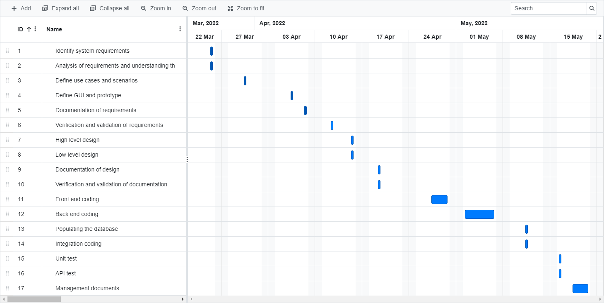

# Project Estimation

Date: 09/04/2022

Version: 1.0

# Estimation approach

Consider the EZWH project as described in YOUR requirement document, assume that you are going to develop the project INDEPENDENT of the deadlines of the course

# Estimate by size

###

|                                                                                                         | Estimate                                 |
| ------------------------------------------------------------------------------------------------------- | ---------------------------------------- |
| NC = Estimated number of classes to be developed                                                        | 15 (considering the actors and glossary) |
| A = Estimated average size per class, in LOC                                                            | 150 LOC                                  |
| S = Estimated size of project, in LOC (= NC \* A)                                                       | 2250                                     |
| E = Estimated effort, in person hours (here use productivity 10 LOC per person hour)                    | 225 ph                                   |
| C = Estimated cost, in euro (here use 1 person hour cost = 30 euro)                                     | 6750 € (personnel)                       |
| Estimated calendar time, in calendar weeks (Assume team of 4 people, 8 hours per day, 5 days per week ) | 1.5 calendar weeks                       |

# Estimate by product decomposition

###

| component name       | Estimated effort (person hours) |
| -------------------- | ------------------------------- |
| requirement document | 48 ph                           |
| GUI prototype        | 20 ph                           |
| design document      | 60 ph                           |
| code                 | 63 ph                           |
| unit tests           | 15 ph                           |
| api tests            | 10 ph                           |
| management documents | 50 ph                           |

# Estimate by activity decomposition

###

| Activity name                                             | Estimated effort (person hours) |
| --------------------------------------------------------- | ------------------------------- |
| Requirements                                              |                                 |
| - Identify system requirements                            | 2 ph                            |
| - Analysis of requirements and understanding the problems | 2 ph                            |
| - Define use cases and scenarios                          | 16 ph                           |
| - Define GUI and prototype                                | 25 ph                           |
| - Documentation of requirements                           | 4 ph                            |
| - Verification and validation of requirements             | 2 ph                            |
| Design                                                    |                                 |
| - High level design                                       | 10 ph                           |
| - Low level design                                        | 15 ph                           |
| - Documentation of design                                 | 8 ph                            |
| - Verification and validation of documentation            | 5 ph                            |
| Coding                                                    |                                 |
| - Front end coding                                        | 20 ph                           |
| - Back end coding                                         | 30 ph                           |
| - Populating the database                                 | 5 ph                            |
| - Integration coding                                      | 11 ph                           |
| Testing                                                   |                                 |
| - Unit test                                               | 15 ph                           |
| - API test                                                | 10 ph                           |
| Management documents                                      | 40ph                            |

###

# Summary

In the estimation by size we only considered the coding effort.

|                                    | Estimated effort | Estimated duration |
| ---------------------------------- | ---------------- | ------------------ |
| estimate by size                   | 225 ph           | 1.5 weeks          |
| estimate by product decomposition  | 266 ph           | 1.7 weeks          |
| estimate by activity decomposition | 220 ph           | 1.4 weeks          |
