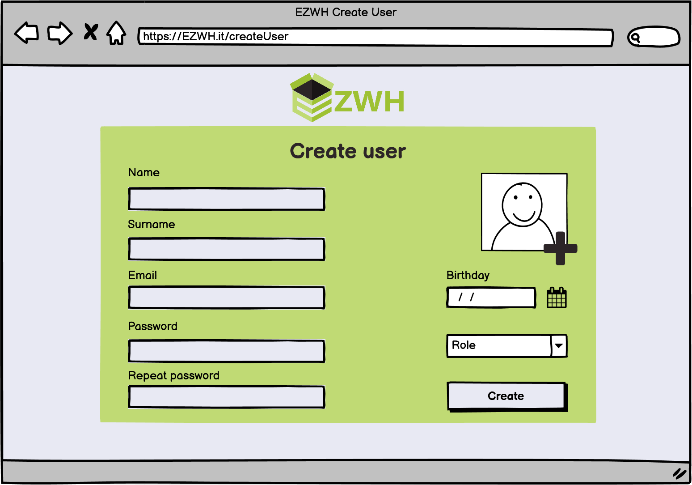

# Graphical User Interface Prototype  

Authors: Edoardo Novara, Riccardo Salvatelli, Sebastian Gutierrez, Longsheng Zhao

Date: 6 april, 2022

Version: 1.0

\<Report here the GUI that you propose. You are free to organize it as you prefer. A suggested presentation matches the Use cases and scenarios defined in the Requirement document. The GUI can be shown as a sequence of graphical files (jpg, png)  >

