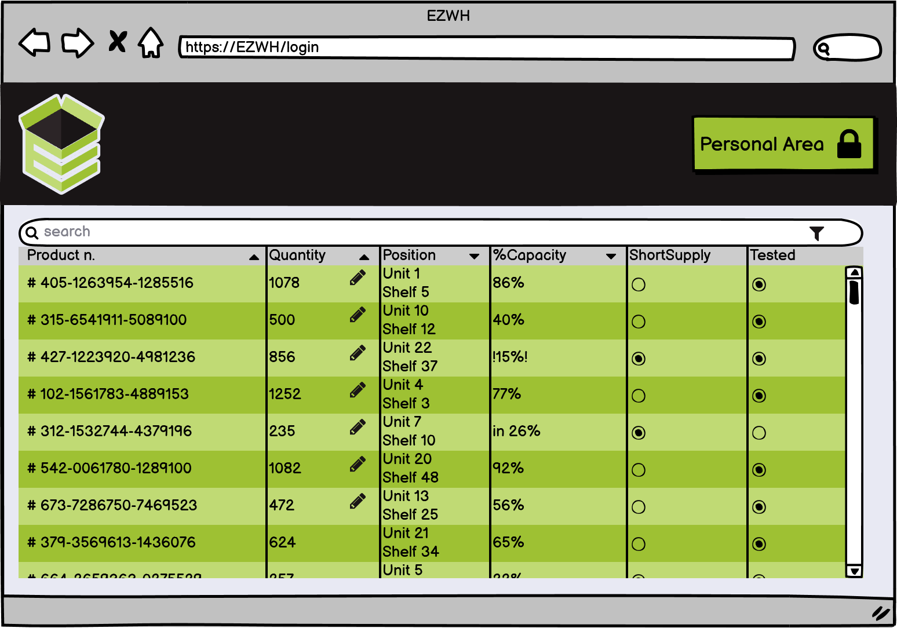

# Graphical User Interface Prototype

Authors: Edoardo Novara, Riccardo Salvatelli, Sebastian Gutierrez, Longsheng Zhao

Date: 13 april, 2022

Version: 1.1

\<Report here the GUI that you propose. You are free to organize it as you prefer. A suggested presentation matches the Use cases and scenarios defined in the Requirement document. The GUI can be shown as a sequence of graphical files (jpg, png) >

|  |
|:--:|
| <b>Employee's personal page</b>|

|  |
| :------------------------------------: |
|   <b>Employee's product manager</b>    |

|  |
| :----------------------------------------: |
|       <b>Manager's personal page</b>       |

|  |
| :-------------------------------------------: |
|       <b>Manager's product manager</b>        |
