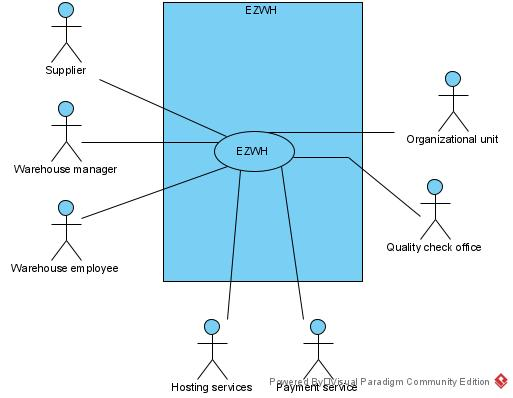
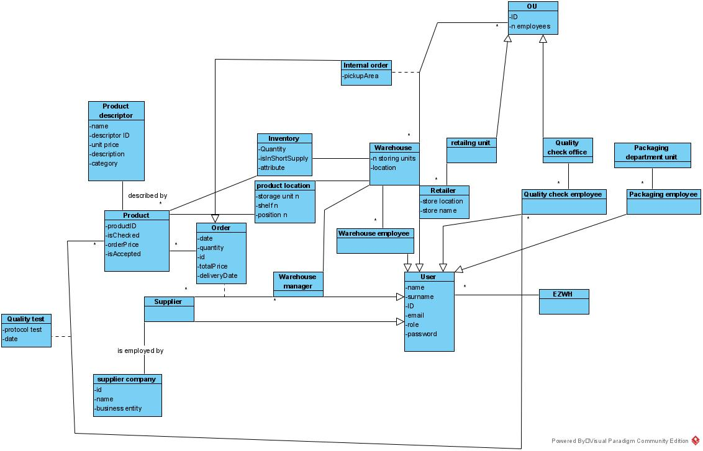

# Requirements Document

Date: 6 april 2022

Version: 1.0

| Version number | Change                                                                                     |
| -------------- | :----------------------------------------------------------------------------------------- |
| 1.0            | Stakeholders, context diagram, FR and NR, UC diagram, glossary and Deployment digram added |

# Contents

- [Informal description](#informal-description)
- [Stakeholders](#stakeholders)
- [Context Diagram and interfaces](#context-diagram-and-interfaces)
  - [Context Diagram](#context-diagram)
  - [Interfaces](#interfaces)
- [Stories and personas](#stories-and-personas)
- [Functional and non functional requirements](#functional-and-non-functional-requirements)
  - [Functional Requirements](#functional-requirements)
  - [Non functional requirements](#non-functional-requirements)
- [Use case diagram and use cases](#use-case-diagram-and-use-cases)
  - [Use case diagram](#use-case-diagram)
  - [Use cases](#use-cases) + [Relevant scenarios](#relevant-scenarios)
- [Glossary](#glossary)
- [System design](#system-design)
- [Deployment diagram](#deployment-diagram)

# Informal description

Medium companies and retailers need a simple application to manage the relationship with suppliers and the inventory of physical items stocked in a physical warehouse.
The warehouse is supervised by a manager, who supervises the availability of items. When a certain item is in short supply, the manager issues an order to a supplier. In general the same item can be purchased by many suppliers. The warehouse keeps a list of possible suppliers per item.

After some time the items ordered to a supplier are received. The items must be quality checked and stored in specific positions in the warehouse. The quality check is performed by specific roles (quality office), who apply specific tests for item (different items are tested differently). Possibly the tests are not made at all, or made randomly on some of the items received. If an item does not pass a quality test it may be rejected and sent back to the supplier.

Storage of items in the warehouse must take into account the availability of physical space in the warehouse. Further the position of items must be traced to guide later recollection of them.

The warehouse is part of a company. Other organizational units (OU) of the company may ask for items in the warehouse. This is implemented via internal orders, received by the warehouse. Upon reception of an internal order the warehouse must collect the requested item(s), prepare them and deliver them to a pick up area. When the item is collected by the other OU the internal order is completed.

EZWH (EaSy WareHouse) is a software application to support the management of a warehouse.

# Stakeholders

| Stakeholder name           |                                                      Description                                                       |
| -------------------------- | :--------------------------------------------------------------------------------------------------------------------: |
| Suppliers                  |                                Receive orders from retailers and send the items to them                                |
| Retailers                  |                             Sell the products shipped from the warehouse to the end users                              |
| Warehouse                  |                                    The physical structure which stores the products                                    |
| Warehouse employees        |                                     They physically put the items on the shelves.                                      |
| Warehouse manager          |                                            Checks the availability of items                                            |
| Quality check office       |                                   The organization in charge of doing quality checks                                   |
| Quality check protocols    |                                      The rules followed to do the quality checks                                       |
| Stress test department     |                               Tests the product for its ability to be subject to stress                                |
| Strain test department     |                               Tests the product for its ability to be subject to stress                                |
| Durability test department |                               Tests the product for its ability to be subject to strain                                |
| Efficiency test department |                                          Tests the product for its efficiency                                          |
| Usability test department  |                                         Tests the product for its ease of use                                          |
| Marketing department       |                     Make the product more well known and appealing to end users through publicity                      |
| Organisational units       |                                       They can ask for items from the warehouse                                        |
| Delivery service           | The physical service that brings the products from the warehouse to the retailer or from the supplier to the warehouse |
| Hosting services           |                         Provides services for hosting, storing, and communication to EZWH app                          |
| Payment service            |                    Provides to suppliers and warehouse the services to keep their transactions safe                    |
| Software engineers         |                                                   build the EZWH app                                                   |
| DB administrator           |                                      Manages the database of products in the app                                       |
| IT administrator           |                                            Manages the application overall                                             |
| Security manager           |                                            responsible for security issues                                             |
| Competitors                |                 Interested on the development of the EZWH and its impact on the common business model                  |
| Company owners             |                       Interested on the impact and saving that EZWH might cause for the company                        |

# Context Diagram and interfaces

## Context Diagram

## Interfaces

| Actor                |    Logical Interface     |  Physical Interface |
| -------------------- | :----------------------: | ------------------: |
| Supplier             |           GUI            |         Supplier PC |
| Warehouse manager    |           GUI            |      Manager Tablet |
| Warehouse employee   |           GUI            |       Mobile device |
| Hosting service      |      HTTP/JSON API       | Internet connection |
| Payment service      | VISA API, Mastercard API | Internet connection |
| Quality check office |           GUI            |                  PC |
| Organisational units |           GUI            |                  PC |

# Stories and personas

| Persona, age, story                                                                                                                                                 | Goals                                                                                                                                                                                                                                                                                           |
| ------------------------------------------------------------------------------------------------------------------------------------------------------------------- | :---------------------------------------------------------------------------------------------------------------------------------------------------------------------------------------------------------------------------------------------------------------------------------------------- |
| Yehu’ Zoe Gatsby, 24, warehouse employee, great guy overall but probably keeps a mysterious secret                                                                  | While he’s not looking for well-hidden spots in the warehouse, he wants to easily find where a product is placed and quickly set the position attribute of a product. He is not used to using mobile devices, so an easy design for the app would be the best.                                  |
| Tito Svenson, 56, warehouse manager, pretends he has seen star wars to relate to his younger colleagues but has actually only read the wiki                         | As the warehouse manager, Mr Svenson is responsible for supervising the availability of items and his employees. He needs (and wants) to communicate often with them and would like an app that lets him update product data on the go, may the force be with him or whatever Darth Vader said. |
| Franca Panella, 41, store clerk, has said “I love you” on different occasions, but never actually meant it. She orders weekly from the warehouse through APP.       | Working as a retailer of the warehouse, Ms Panella concerns about the price, general quality and response time from the warehouse. She always loves the lowest price for the best quality, as she loves everyone (or does she?).                                                                |
| Francesco Virgolini, 52, supplier manager, receives loads of orders from different warehouses, he struggles to ship its orders because of the lack of communication | As supplier manager he wants to keep pretty neat all the orders that come from the warehouses in order to keep track of them and ship them adequately.                                                                                                                                          |

# Functional and non functional requirements

## Functional Requirements

| ID     |             Description              |
| ------ | :----------------------------------: |
| F1     |                Login                 |
| F1.1   |            Login as admin            |
| F1.2   |          Login as employee           |
| F1.2.1 |     Login as warehouse employee      |
| F1.2.2 |       Login as product tester        |
| F1.3   |          Login as retailer           |
| F2     |                logout                |
| F3     |            Manage product            |
| F3.1   |            Search product            |
| F3.1.1 |   Search products in short supply    |
| F3.2   |            Update product            |
| F3.2.1 |     Update product availability      |
| F3.2.2 |        Update product status         |
| F3.3   |          Insert new product          |
| F3.4   | Search product location in warehouse |
| F3.5   |      Select random for testing       |
| F3.6   |          View order history          |
| F4     |           Manage suppliers           |
| F4.1   |          View supplier list          |
| F4.2   |      Remove from supplier list       |
| F4.3   |       Add new supplier to list       |
| F5     |           Choose supplier            |
| F6     |       Send request to supplier       |
| F7     |      Send request to warehouse       |
| F8     |         Manage transactions          |
| F9     |             Manage users             |
| F9.1   |           Create new user            |
| F9.2   |         Delete existing user         |
| F9.3   |            Edit user data            |

## Non Functional Requirements

| ID   | Type (efficiency, reliability, ..) |                                                        Description                                                        | Refers to |
| ---- | :--------------------------------: | :-----------------------------------------------------------------------------------------------------------------------: | --------: |
| NFR1 |             Efficiency             |                                       Response time <0.25 seconds for all functions                                       |    All FR |
| NFR2 |               Memory               |                                          Ram <0.5Gbyte Hard disk < 3.2 Gbyte                                          |    All FR |
| NFR3 |                                    |                                                 <1 server crash per year                                                  |    All FR |
| NFR4 |              Privacy               | No personal data is to be disclosed to anyone with exception to the owner and other authorized roles (e.g. administrator) |    All FR |
| NFR5 |             Usability              |                                     The user should deal with one interface at a time                                     |    All FR |
| NFR6 |            Portability             |          The software should be available for PCs and handheld devices for usage while working in the warehouse           |    All FR |
| NFR7 |            Reliability             |                                                <1 defect per user per year                                                |    All FR |

# Use case diagram and use cases

## Use case diagram

### Use case 1, UC1 - Login

| Actors Involved  | Warehouse employee, Supplier, Organizational unit employee, Quality check office employee |
| ---------------- | :---------------------------------------------------------------------------------------: |
| Precondition     |                           The user exists and is not logged in                            |
| Post condition   |                                   The user is logged in                                   |
| Nominal Scenario |             The user opens the software and logs in to their personal profile             |
| Variants         |                                                                                           |
| Exceptions       |                      The user doesn’t exist or accesses the wrong OU                      |

#### Scenario 1.1

| Scenario 1.1   |                  Nominal scenario                  |
| -------------- | :------------------------------------------------: |
| Precondition   |        The user exists and is not logged in        |
| Post condition |               The user is logged in                |
| Step#          |                    Description                     |
| Step 1         |    User U opens the app on its device of choice    |
| Step 2         |      User U chooses their organizational unit      |
| Step 3         | User U inserts its credentials (mail and password) |
| Step 4         |          User has access to their profile          |

#### Scenario 1.2

| Scenario 1.2   |                                       User accesses wrong OU                                       |
| -------------- | :------------------------------------------------------------------------------------------------: |
| Precondition   |                                The user exists and is not logged in                                |
| Post condition |                                The user is redirected to login page                                |
| Step#          |                                            Description                                             |
| Step 1         |                            User U opens the app on its device of choice                            |
| Step 2         |                              User U chooses wrong organizational unit                              |
| Step 3         |                         User U inserts its credentials (mail and password)                         |
| Step 4         | The software issues a warning and tells the user that the credentials are linked to a different OU |

#### Scenario 1.3

| Scenario 1.3   |                                            User enters wrong credentials                                            |
| -------------- | :-----------------------------------------------------------------------------------------------------------------: |
| Precondition   |                                        The user exists and is not logged in                                         |
| Post condition |                                  The user is asked to input the credentials again                                   |
| Step#          |                                                     Description                                                     |
| Step 1         |                                    User U opens the app on its device of choice                                     |
| Step 2         |                                       User U chooses the organizational unit                                        |
| Step 3         |                                User U inserts wrong credentials (mail and password)                                 |
| Step 4         | The software issues a warning and tells the user that at least a credential is incorrect, and is asked to try again |

### Use case 2, UC2 - Order a product

| Actors Involved  |                                  Warehouse manager                                   |
| ---------------- | :----------------------------------------------------------------------------------: |
| Precondition     | User U is logged in as the warehouse manager WM and the product P is in short supply |
| Post condition   |                 The order request is sent to the supplier of choice                  |
| Nominal Scenario |     The WM orders a product form a supplier and pays for it through the software     |
| Variants         |                                                                                      |
| Exceptions       |                        The WM is unable to order the product                         |

#### Scenario 2.1

| Scenario 2.1   |                                   Nominal scenario                                   |
| -------------- | :----------------------------------------------------------------------------------: |
| Precondition   | User U is logged in as the warehouse manager WM and the product P is in short supply |
| Post condition |                 The order request is sent to the supplier of choice                  |
| Step#          |                                     Description                                      |
| Step 1         |                      The WM searches a product in short supply                       |
| Step 2         |           The WM chooses how many units of the products they want to order           |
| Step 3         |                  The WM then chooses from which supplier they order                  |
| Step 4         |           The order is placed and the WM is redirected to the payment page           |
| Step 5         |         The WM pays for the order, which is issued to the supplier of choice         |

#### Scenario 2.2

| Scenario 2.2   |                          Supplier can’t provide the product                          |
| -------------- | :----------------------------------------------------------------------------------: |
| Precondition   | User U is logged in as the warehouse manager WM and the product P is in short supply |
| Post condition |                     The user is redirected to the supplier list                      |
| Step#          |                                     Description                                      |
| Step 1         |                      The WM searches a product in short supply                       |
| Step 2         |           The WM chooses how many units of the products they want to order           |
| Step 3         |                  The WM then chooses from which supplier they order                  |
| Step 4         |        The supplier can’t provide the product, the software issues a warning         |
| Step 5         |                    The WM is redirected to the list of suppliers                     |

### Use case 3, UC3 - Look for a product

| Actors involved |                       Warehouse manager, OU employee                       |
| --------------- | :------------------------------------------------------------------------: |
| Precondition    |                              User U is logged                              |
| Postcondition   |                            The product is shown                            |
| Nominal         |       User searches for a specific product providing its information       |
| Variants        |                                                                            |
| 3.1             |                   User successfully locates the product                    |
| 3.2             |       The product is not current in storage, program issue a warning       |
| 3.3             | The product is not sufficient for the requirement, program issue a warning |

| Scenario 3.1  |    User successfully locates the product     |
| ------------- | :------------------------------------------: |
| Precondition  |               User U is logged               |
| Postcondition |           User locates the product           |
| Step#         |                 Description                  |
| Step 1        |           User chooses the product           |
| Step 2        | User specifies the amount of the requirement |
| Step 3        |           User finds the location            |

| Scenario 3.2 | The product is not current in storage, program issue a warning |
| ------------ | :------------------------------------------------------------: |
| Precondition |                        User U is logged                        |
| Potcondition |                User failed locating the product                |
| Step#        |                          Description                           |
| Step 1       |                    User chooses the product                    |
| Step 2       |    The product is not in storage, program issues a warning     |

| Scenario 3.3  | The product is not sufficient for the requirement, program issue a warning |
| ------------- | :------------------------------------------------------------------------: |
| Precondition  |                              User U is logged                              |
| Postcondition |                      User failed locating the product                      |
| Step#         |                                Description                                 |
| Step 1        |                          User chooses the product                          |
| Step 2        |                User specifies the amount of the requirement                |
| Step 3        |          The storage is not sufficient, program issues a warning           |

### Use case 4, UC4 - Create a new product

| Actors involved |                                                               Warehouse manager                                                               |
| --------------- | :-------------------------------------------------------------------------------------------------------------------------------------------: |
| Precondition    |                                                               User U is logged                                                                |
| Postcondition   |                                                            The product is created                                                             |
| Nominal         | The warehouse manager adds a new product into the list providing its informations, the program searches for the available supplier and amount |
| Variants        |                                                                                                                                               |
| 4.1             |                                               The product is successfully added with available                                                |
| 4.2             |                                                         The product is already added                                                          |
| 4.3             |                                     The product is added but without any available supplier at the moment                                     |

#### Scenario 4.1

| Scenario 4.1  |     The product is successfully added with available      |
| ------------- | :-------------------------------------------------------: |
| Precondition  |           User has already logged in as manager           |
| Postcondition |                  User adds a new product                  |
| Step#         |                        Description                        |
| Step 1        |           User fill in the name of the product            |
| Step 2        | The application searches for available supplier and price |
| Step 3        |                   User adds the product                   |

#### Scenario 4.2

| Scenario 4.2  |            The product is already added            |
| ------------- | :------------------------------------------------: |
| Precondition  |       User has already logged in as manager        |
| Postcondition |           User failed adding new product           |
| Step#         |                    Description                     |
| Step 1        |        User fill in the name of the product        |
| Step 2        | The application finds the product is already added |
| Step 3        |          The application issues a warning          |

#### Scenario 4.3

| Scenario 4.3  | The product is added but without any available supplier at the moment |
| ------------- | :-------------------------------------------------------------------: |
| Precondition  |                 User has already logged in as manager                 |
| Postcondition |                        User adds a new product                        |
| Step#         |                              Description                              |
| Step 1        |                 User fill in the name of the product                  |
| Step 2        |       The application searches for available supplier and price       |
| Step 3        |            The application cannot find available suppliers            |
| Step 4        |                   The application issues a warning                    |

### Use case 5, UC5 - Remove supplier

| Actors involved |                             Warehouse manager                              |
| --------------- | :------------------------------------------------------------------------: |
| Precondition    |                              User U is logged                              |
| Postcondition   |                   The supplier is removed from database                    |
| Nominal         | The WM chooses a supplier and removes it from the database of the software |
| Variants        |                                                                            |
| 3.1             |                   User successfully locates the product                    |
| 3.2             |       The product is not current in storage, program issue a warning       |
| 3.3             | The product is not sufficient for the requirement, program issue a warning |

#### Scenario 5.1

| Scenario 5.1   |                            Nominal scenario                            |
| -------------- | :--------------------------------------------------------------------: |
| Precondition   | User is logged in as Warehouse Manager WH, supplier exists in database |
| Post condition |                   Supplier is removed from database                    |
| Step#          |                              Description                               |
| Step 1         |     Through manage suppliers, the list of suppliers is visualized      |
| Step 2         |             The WM chooses the option to remove a supplier             |
| Step 3         |                        The supplier is selected                        |
| Step 4         |                   The software asks for confirmation                   |
| Step 5         |                 The supplier is removed from the list                  |

### Use case 6, UC6 - View order history

| Actors Involved  |                             Warehouse manager, supplier and organisational units                             |
| ---------------- | :----------------------------------------------------------------------------------------------------------: |
| Precondition     |                                            User already logged in                                            |
| Post condition   |                                        The order history is displayed                                        |
| Nominal Scenario |                             The user U goes to the “View order history” section                              |
| Variants         | The warehouse manager can distinguish between order history (from supplier to warehouse) and internal orders |

#### Scenario 6.1

| Scenario 6.1   | U is a supplier or an organisational unit |
| -------------- | :---------------------------------------: |
| Precondition   |          U has already logged in          |
| Post condition |      The order history is displayed       |
| Step#          |                Description                |
| Step 1         |    U opens the view order history page    |

#### Scenario 6.2

| Scenario 6.2   |                             U is a warehouse manager                             |
| -------------- | :------------------------------------------------------------------------------: |
| Precondition   |                             U has already logged in                              |
| Post condition |                          The order history is displayed                          |
| Step#          |                                   Description                                    |
| Step 1         |                       U opens the view order history page                        |
| Step 2         | U can choose to view order history with both the 2 types together or separately. |

### Use case 7, Internal order (retailer to warehouse)

| Actors Involved  |                              OU employee, warehouse employee                              |
| ---------------- | :---------------------------------------------------------------------------------------: |
| Precondition     | A selected set of available products S; one chosen pickup area; User U is an OU employee; |
| Post condition   |          The internal order is submitted and received by the warehouse employee           |
| Nominal Scenario |                                    U submit the order                                     |

#### Scenario 7.1

| Scenario 7.1   |                                      Nominal scenario                                      |
| -------------- | :----------------------------------------------------------------------------------------: |
| Precondition   | A selected set of available products S; one chosen pickup area; User U is an OU employee;  |
| Post condition |           The internal order is submitted and received by the warehouse employee           |
| Step#          |                                        Description                                         |
| Step 1         |                            User chooses a product from the list                            |
| Step 2         |                             User chooses the OU he belongs to                              |
| Step 3         |                         User chooses the amount he needs to order                          |
| Step 4         |                        User confirms the order by clicking confirm                         |
| Step 5         |                              The order is made by the system                               |
| Step 6         | From this moment the warehouse employee can consult and start preparing the internal order |

### Use case 8, UC8 - Create user

| Actors Involved  |                                           Warehouse manager                                            |
| ---------------- | :----------------------------------------------------------------------------------------------------: |
| Precondition     |                                 Account user does not exist in system                                  |
| Post condition   |                                    Account user added in the system                                    |
| Nominal Scenario |                       New user creates a new account U and populates its fields                        |
| Exceptions       | A user can create only one account, this is checked through the email (one email, one account at most) |

#### Scenario 8.1

| Scenario 8.1   |                                                                              Nominal scenario                                                                               |
| -------------- | :-------------------------------------------------------------------------------------------------------------------------------------------------------------------------: |
| Precondition   |                                                                    Account user does not exist in system                                                                    |
| Post condition |                                                                      Account user added in the system                                                                       |
| Step#          |                                                                                 Description                                                                                 |
| Step 1         | The system shows a form containing name, surname, birthdate, rol(warehouse employee, supplier, retailer, quality check employee), email, password and repeat password field |
| Step 2         |                                               The not registered user populate its information in the form and select send it                                               |
| Step 3         |                                                       The system save the data and creates the new user successfully                                                        |

#### Scenario 8.2

| Scenario 8.2   |                                                                             User already exists                                                                             |
| -------------- | :-------------------------------------------------------------------------------------------------------------------------------------------------------------------------: |
| Precondition   |                                                                        Account user exists in system                                                                        |
| Post condition |                                                                         Account user is not created                                                                         |
| Step#          |                                                                                 Description                                                                                 |
| Step 1         | The system shows a form containing name, surname, birthdate, rol(warehouse employee, supplier, retailer, quality check employee), email, password and repeat password field |
| Step 2         |                                               The not registered user populate its information in the form and select send it                                               |
| Step 3         |                                     The system validate that there is a existing user with the same information and does not create it                                      |

### Use case 9, UC9 - Test product

| Actors Involved  |                                       Quality check office                                        |
| ---------------- | :-----------------------------------------------------------------------------------------------: |
| Precondition     |               Quality check user is logged in and there are products to be checked                |
| Post condition   |                           Products are updated in system with the check                           |
| Nominal Scenario | Quality check office check for the quality of products and update their information in the system |
| Variants         |                                      Product already checked                                      |

#### Scenario 9.1

| Scenario 9.1   |                                                                                Nominal scenario                                                                                 |
| :------------- | :-----------------------------------------------------------------------------------------------------------------------------------------------------------------------------: | 
| Precondition   |                                                      Quality check user is logged in and there are products to be checked                                                       |
| Post condition |                                                                  Products are updated in system with the check                                                                  | and its evaluation |
| Step#          |                                                                                   Description                                                                                   |
| Step 1         |                                               The system shows a random list of the products that do not have yet a quality check                                               |
| Step 2         | Quality check user check those products manually and update the information of each of them from non-checked to checked and its corresponding evaluation (accepted or rejected) |
| Step 3         |                                     The system updates the information of the products and discarded from the list of products to be check                                      |

#### Scenario 9.2

| Scenario 9.2   |                                                   Products already checked                                                    |
| -------------- | :---------------------------------------------------------------------------------------------------------------------------: |
| Precondition   |                            Quality check user is logged in and there are products already checked                             |
| Post condition |                                         Products are updated in system with the check                                         | and its evaluation |
| Step#          |                                                          Description                                                          |
| Step 1         |                      The system shows a random list of the products that do not have yet a quality check                      |
| Step 2         | Quality check user notices that there are products that are already checked manually and its simply updates their information |
| Step 3         |            The system updates the information of the products and discarded from the list of products to be check             |

# Glossary

# System Design

# Deployment Diagram

